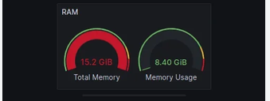

# Nettoyeur RAM TV

Utilitaire Android TV (Leanback) pour les box bas de gamme type Amlogic / Mecool :
libérer la RAM, arrêter des applications, désactiver le *bloatware* préinstallé et
visualiser la consommation mémoire par application.

Construit **sans Gradle** : `aapt2` + `javac` + `d8` en ligne de commande
(`ram-cleaner-tv-src/build-standalone.sh`).



## Fonctionnalités

| Écran | Contenu |
|-------|---------|
| **Accueil** | Thème sombre, deux jauges circulaires (mémoire totale / utilisée), pourcentage d'utilisation en temps réel, RAM libre. Bouton **Nettoyer la RAM** : `killBackgroundProcesses` sur toutes les apps tierces. |
| **Gérer les apps** | Liste des applications système préinstallées (hors cœur du système et lanceurs). Par ligne : **Arrêter** (force-stop en arrière-plan) et **Activer / Désactiver**. |
| **Consommation RAM** | Tableau `Application · RAM · Part %` trié par consommation, rafraîchi toutes les 2 s. |

### Désactivation des apps

Deux modes, choisis automatiquement :

- **Sans privilège** : `PackageManager.setApplicationEnabledSetting`. Si l'OEM refuse,
  l'app ouvre la fiche système (désactivation manuelle).
- **Device owner** : `DevicePolicyManager.setApplicationHidden`, désactivation directe.
  À activer une seule fois, box sans compte Google :
  ```
  adb shell dpm set-device-owner com.aia.ramcleaner/.AdminReceiver
  ```

### Consommation RAM — limites

Sur Android 7+, une application ordinaire (même *device owner*) ne peut pas lire la
mémoire des autres applications. Sources tentées dans l'ordre :

1. `su -c "dumpsys meminfo"` — chiffres réels de tous les processus (**box rootée**).
2. `dumpsys meminfo` — seulement si la permission `DUMP` est accordée (ex. lancement `adb`).
3. `getRunningAppProcesses` + `getProcessMemoryInfo` — repli, souvent limité à cette
   app ; le bandeau indique alors « affichage partiel ».

## Build

Prérequis : JDK 17, Android `build-tools;34.0.0`, `platforms;android-34`.

```bash
BUILD_HOME=$HOME/.cache/ramcleaner-build \
JAVA_HOME=/chemin/vers/jdk-17 \
ANDROID_SDK_ROOT=/chemin/vers/android-sdk \
bash ram-cleaner-tv-src/build-standalone.sh
```

Variables surchargeables : `BUILD_HOME`, `JAVA_HOME`, `ANDROID_SDK_ROOT`,
`BUILD_TOOLS`, `ANDROID_JAR`, `KEYSTORE`, `APK_OUT`. Sortie : `ram-cleaner-tv.apk`
(signé avec un keystore de debug généré au premier lancement).

Étapes : `aapt2 compile` → `aapt2 link` → `javac` → `d8` → `zipalign` → `apksigner`.

## Installation

```bash
adb install -r ram-cleaner-tv.apk
```

## Structure

```
ram-cleaner-tv-src/
  AndroidManifest.xml         appCategory=productivity, isGame=false
  build-standalone.sh         build aapt2/javac/d8
  res/
    layout/                   activity_main, activity_apps, activity_ram_table, row_app, row_ram
    drawable/                 card_bg, btn_bg, window_bg, banner, ic_launcher
    values/                   colors, styles (AppTheme), strings
  src/com/aia/ramcleaner/
    MainActivity.java         accueil + jauges
    GaugeView.java            vue custom : arc 270°, valeur centrée, animation
    AppsActivity.java         liste bloat + arrêter / activer / désactiver
    RamTableActivity.java     tableau consommation RAM
    AdminReceiver.java        DeviceAdminReceiver (mode device owner)
```

## Permissions

- `KILL_BACKGROUND_PROCESSES` — nettoyage et bouton Arrêter.
- `CHANGE_COMPONENT_ENABLED_STATE` — activation / désactivation d'apps.
- `BIND_DEVICE_ADMIN` (receiver) — mode device owner optionnel.

`minSdk 22`, `targetSdk 29`.
